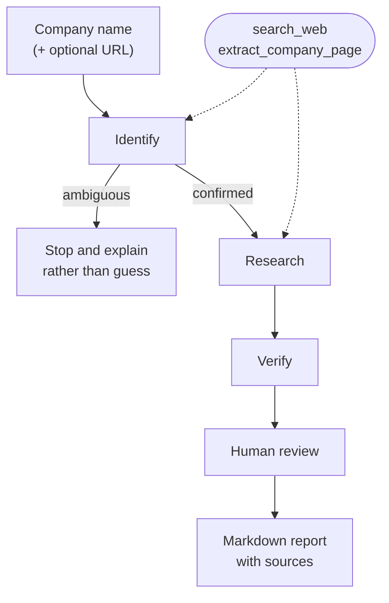

# Competitor Research Agent

An agentic AI tool that researches a startup's competitive landscape and produces a sourced Markdown report a founder can actually act on.

Give it a company name — and optionally a URL — and it identifies the company, decides for itself what to search, finds comparable competitors, independently verifies them, asks you to approve the result, and writes a report that cites where every claim came from.

---

## Why this exists

You could ask a chatbot "who are Acme's competitors?" and get an answer in seconds. That answer has three problems:

1. **It may be invented.** Ask about a small company and a language model will often produce a confident, well-formatted profile of a company it knows nothing about.
2. **You can't check it.** No sources, no way to tell which parts are solid and which are guesses.
3. **It isn't reproducible.** Ask twice, get two different answers, with no record of what was considered or rejected.

This tool is built around the assumption that **the model will sometimes be wrong**, and that the job of the surrounding system is to catch it, show its work, and stop rather than guess. What it sells is not intelligence — it's **traceability**.

---

## What it does



| Step | What happens | What it protects against |
|---|---|---|
| **Identify** | Confirms which company is meant. A URL, if given, outranks search results. | Researching a different company that shares the name |
| **Research** | The agent chooses its own search queries, iterating until it has enough. | Stale training data; one fixed query missing the point |
| **Verify** | A **separate** call re-checks each competitor: is it a real, named company, and is it comparable in scale? | Generic placeholders; competitors 50× the target's size |
| **Review** | You see every competitor and every rejection, and can remove any. | Everything the automated checks missed |
| **Report** | Markdown with per-competitor sources, exclusions, and stated limitations. | Unverifiable claims presented as fact |

---

## Setup

Requires Python 3.11+. Both API keys have free tiers and need no credit card.

```bash
git clone <your-repo-url>
cd competitor-research-agent

python -m venv venv
venv\Scripts\activate        # Windows
source venv/bin/activate     # macOS / Linux

pip install -r requirements.txt
```

Create a `.env` file in the project root:

```
GEMINI_API_KEY=your-key-here
TAVILY_API_KEY=your-key-here
```

- **Gemini API key** — [Google AI Studio](https://aistudio.google.com) (free tier, no card)
- **Tavily API key** — [tavily.com](https://tavily.com) (1,000 searches/month free, no card)

> A Gemini *app* subscription is not the same thing as an API key. The key comes from AI Studio.

---

## Usage

```bash
python main.py
```

```
Enter a company or startup name: Sprout Design
Company website or LinkedIn URL (optional, press Enter to skip): https://sproutdesign.framer.website/

[extract] https://sproutdesign.framer.website/

Confirmed: Sprout Design is a boutique design studio founded by two IIT alumni,
combining product design, website design, and design strategy for startups.

[search] boutique product design studio MVP agency startup website design

================================================================
REVIEW
================================================================

Automatically excluded by verification:
  - 500 Designs: significantly larger and more established (part of the 500 Global
    ecosystem, executing enterprise projects), representing a scale mismatch.

4 competitor(s) passed verification:

  [0] UX Cabin — Flexible, senior-level boutique design partner for lean startup teams.
  [1] Semiflat Studio — Production-ready interface design specialists.
  [2] Orbix Studio — Rapid concept-to-launch execution.
  [3] Valtorian — Zero-handoff, direct-with-founders boutique studio.

Enter the numbers of any you want REMOVED (comma-separated), or press Enter to keep all:

Report written to report-sprout-design.md
4 competitor(s) included, 1 excluded.
```

Passing a URL is optional but strongly recommended for small or common-named companies. Without one, the tool will refuse to proceed if it can't tell which company you mean — see below.

A full generated report is committed as [`example-report.md`](example-report.md).

---

## Design decisions

Every safeguard here exists because of a specific observed failure, not because it sounded good in theory.

**Identity is confirmed before research begins.**
Asked about a two-person studio called "Sprout Design," the system repeatedly produced polished reports about *a different company with the same name* — a UK firm, an unrelated branding studio. Names are ambiguous; a URL is not. When a URL is provided, its page content is treated as authoritative and outranks anything search returns.

**When identity is ambiguous, it stops.**
An earlier version asked the user "is this the company you meant?" and continued on a yes. That was unsafe: confirming a description that said *"no entity could be verified"* let the research step latch onto the wrong company and spend its whole budget there. Now, low confidence is a hard stop with an explanation. **Refusing to answer is a feature.**

**Verification is a separate call with no shared history.**
A model asked to re-check its own reasoning tends to agree with itself. The verifier sees the proposed competitors and the target company — but not the reasoning that produced them.

**The verifier knows the target's scale.**
An early version passed only the company *name* to the verifier, then asked "is this comparable in scale?" — a question it had no way to answer. Eighty-person agencies sailed through as peers of a two-person studio. The fix: independence means withholding the *reasoning*, never the *subject*.

**Verdicts pair by index, not by name.**
Matching verdicts to competitors by string equality on model-generated names broke whenever the model abbreviated one ("Parallel" vs. "Parallel Design Studios"), producing a report that dropped a competitor and then included it anyway. Competitors are numbered; verdicts echo the number.

**Sources are tracked in code, not by the model.**
The model attributes sources per competitor, which is useful but fallible. Separately, the tools record every URL actually fetched. The report contains both: best-effort attribution, and a list that can't be misremembered.

**Retries are selective.**
Only 429 and 5xx are retried, with exponential backoff. A 404 from a retired model name will fail identically forever; retrying it wastes quota.

**The report publishes what it rejected.**
Most tools show only what they kept. This one lists every rejected candidate with the reason — automated *and* human — so a reader can audit the judgment, not just the conclusion.

---

## Project structure

```
main.py        Orchestration and human review — reads as the workflow
pipeline.py    The three LLM steps: identify, research, verify
prompts.py     All prompt text, with comments on why each constraint exists
tools.py       search_web / extract_company_page, and source tracking
schemas.py     Pydantic models defining every structured output
report.py      Markdown generation
config.py      Clients, model choice, retry policy
```

Prompts live in their own file deliberately: in an LLM application, most iteration happens in prompt text rather than code, so it should be easy to read and compare.

---

## Limitations

Stated plainly here and in every generated report:

- **Source quality is the weakest link.** Searching "best agencies for X" surfaces SEO-optimised marketing content, often published by a company that ranks itself first, with precise-sounding statistics that are unverifiable. Prompting reduces this but cannot fix it — it's a *retrieval* problem, and solving it properly means changing how search works, not what the prompt says.
- **Scale comparison is a judgment call.** Verification catches obvious mismatches but not every borderline one.
- **Coverage is not guaranteed.** The tool finds competitors that are findable; a strong competitor with no web presence will be missed.
- **Small companies remain hard.** Without a URL, a company with a common name and thin web presence may be unidentifiable — by design, the tool stops rather than guessing.

---

## Possible improvements

- Search a company's own site directly instead of relying on listicles, to attack the source-quality problem at the retrieval layer
- An evaluation set of known companies with hand-checked competitors, to measure changes rather than eyeball them
- A Streamlit interface so a non-technical founder can use it
- Caching, so re-running a company doesn't re-spend search quota

---

## Built with

Python · [Google Gemini API](https://ai.google.dev) (`google-genai`) · [Tavily](https://tavily.com) search · Pydantic · Tenacity

No agent framework. The tool-calling loop, structured outputs, and verification step are wired directly against the API — the goal was to understand the mechanics rather than inherit them.
